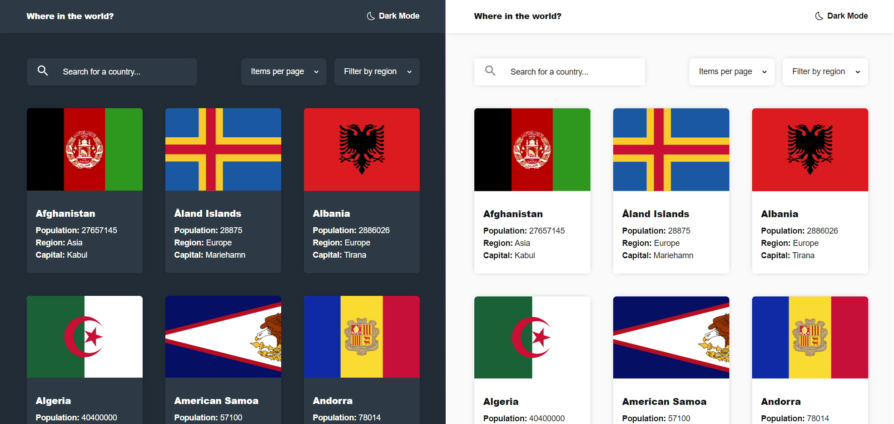
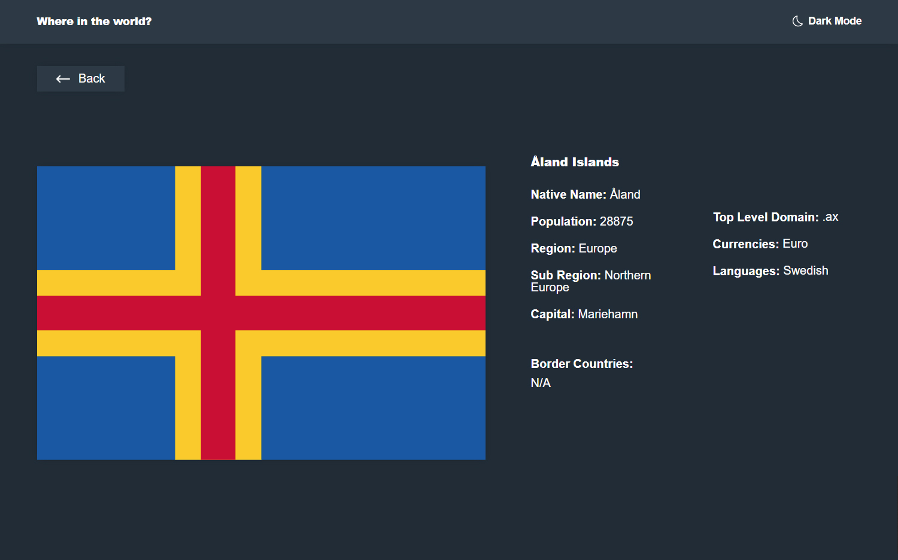

# Frontend Mentor - REST Countries API with color theme switcher solution

This is a solution to the [REST Countries API with color theme switcher challenge on Frontend Mentor](https://www.frontendmentor.io/challenges/rest-countries-api-with-color-theme-switcher-5cacc469fec04111f7b848ca). Frontend Mentor challenges help you improve your coding skills by building realistic projects. 

## Table of contents

- [Overview](#overview)
  - [The challenge](#the-challenge)
  - [Screenshot](#screenshot)
  - [Links](#links)
- [My process](#my-process)
  - [Built with](#built-with)
  - [What I learned](#what-i-learned)
- [Author](#author)

## Overview

### The challenge

Users should be able to:

- See all countries from the API on the homepage
- Search for a country using an `input` field
- Filter countries by region
- Click on a country to see more detailed information on a separate page
- Click through to the border countries on the detail page
- Toggle the color scheme between light and dark mode

### Screenshot

### Links

- Live Site URL: [https://react-scss-countries-api-web-app.netlify.app](https://react-scss-countries-api-web-app.netlify.app)

## My process

### Built with

- Semantic HTML5 markup
- SCSS custom properties
- Flexbox
- CSS Grid
- Mobile-first workflow
- [React](https://reactjs.org/) - JS library

### What I learned

I used query-string in order to filter and format results passing react the variables to update via the URL.

I added in pagination so that countries are shown in an easier format (rather seeing all 250 at once), this was done using reacts useCallback hook so that a function used both on click and on mount wouldn't be called continuously.

SCSS was used to prepare for bigger projects.

## Author

- Website - [Harrison Peace](https://harrisonpeace.com)
- Frontend Mentor - [@HarrisonPeace](https://www.frontendmentor.io/profile/HarrisonPeace)

